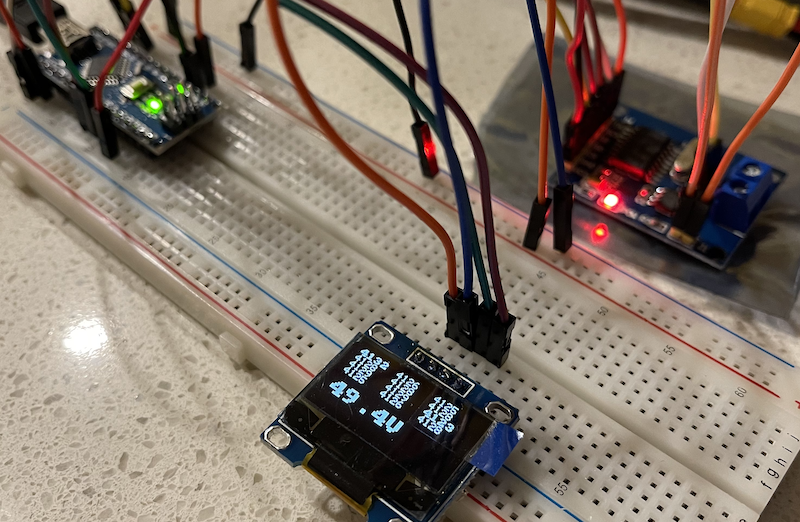

# BMS CAN Display
Arduino program to display battery management system data on an OLED display. Currently only tested with the [FlexiBMS](https://github.com/SimosMCmuffin/FlexiBMS_Lite_FW) (firmware v0.18), but *may* be compatible with other BMSs using the same CAN protocol.

Reads and displays the following data:
- BMS firmware version (on startup only)
- Individual cell voltages
- Total pack voltage

There's a number of other values that could be displayed; some of these are already requested and available for display, others will need different CAN message types to be implemented.

## Dependencies

### Hardware
- Arduino Nano
- MCP2515 Can Bus Module Board
- OLED display (SSD1306 128x64 Display **I2C**)

### Software
These libraries will need to be installed through the Arduino IDE
- [ss_oled](https://github.com/bitbank2/ss_oled)
- [BitBang_I2C](https://github.com/bitbank2/BitBang_I2C)
  - Not used directly, but required by ss_oled
- [arduino-mcp2515](https://github.com/autowp/arduino-mcp2515)

## Setup
Refer to [Balance Buddy documentation](https://github.com/Mitchlol/balance_buddy/blob/main/README.md) for wiring details.

## Acknowledgements
- Mitchlol's Balance Buddy 
  - [https://github.com/Mitchlol/balance_buddy](https://github.com/Mitchlol/balance_buddy)
  - The BMS CAN Display application is a repurposed/rewritten version of the Balance Buddy. The same hardware is used, same libraries used, and a large amount of the code is reused.
- SimosMCmuffin FlexiBMS Lite
  - https://github.com/SimosMCmuffin/FlexiBMS_Lite_FW/
  - CAN protocol was reverse engineered from this firmware repo, although this code itself may originally come from the [DieBieBMS firmware](https://github.com/DieBieEngineering/DieBieMS).
- vedderb bldc
  - https://github.com/vedderb/bldc/
  - Utility functions and typedefs reused to support reading CAN packet data