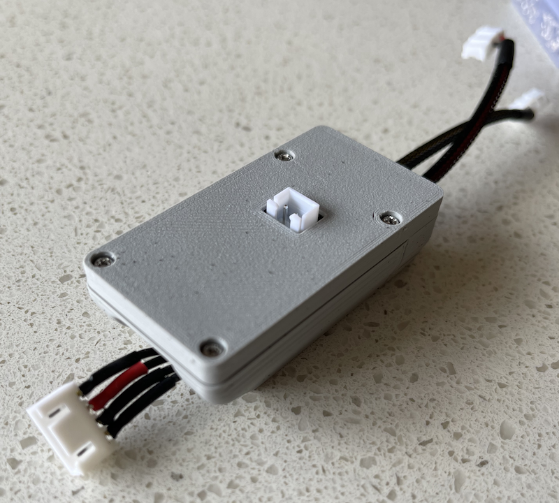

# BMS CAN Case
This folder includes some CAD/STL files that can be used to 3D print a case that will hold the Arduino Nano and MCP2512 module. The case is printed in two halves held together with some M2 self tapping screws. Hole at one end is large enough to fit a JST-XH 4pin connector for an OLED display. There's a gap at the other end for wires to the FlexiBMS (power and CAN).

Some fiddly soldering is required to wire the Arduino and CAN module together. Both boards are facing outwards.

